# PowerShell Help Desk Automation Lab

**PowerShell | Active Directory | Help Desk Automation | Windows Server | User Provisioning | Password Resets | Account Unlocks | CSV Automation | GUI Dashboard**

Hands-on PowerShell automation lab demonstrating common Help Desk and Active Directory administration tasks, including user provisioning, password resets, account lockout recovery, security-group management, bulk user creation, reporting, and a custom Windows GUI dashboard for common support actions.

---

## Project Summary

I built this PowerShell Help Desk Automation Lab to practise how repetitive Active Directory support tasks can be completed efficiently and consistently through automation.

The project combines **PowerShell scripting, Active Directory administration, troubleshooting, bulk provisioning, reporting, and a custom Help Desk GUI dashboard**.

In this lab, I:

- Verified and used the Active Directory PowerShell module
- Queried Active Directory users and account status
- Created new employee accounts through PowerShell
- Troubleshot an Active Directory password-policy error
- Reset user passwords
- Forced password changes at next logon
- Detected and unlocked locked user accounts
- Added users to security groups
- Verified group membership
- Created multiple users from CSV data
- Built a reusable employee onboarding script
- Added duplicate-user checking and error handling
- Generated an Active Directory user report
- Exported Active Directory data to CSV
- Built a custom PowerShell Help Desk Automation Dashboard
- Tested password reset, user lookup, account enable/disable, group checks, and account unlock operations through the GUI

---

# Lab Environment

| Component | Configuration |
|---|---|
| Server | Windows Server |
| Domain | `corp.navtejlab.com` |
| Domain Controller | DC01 |
| Identity Platform | Active Directory Domain Services |
| Automation | Windows PowerShell |
| PowerShell Module | ActiveDirectory |
| Script Editor | Windows PowerShell ISE |
| User OU | Employees |
| Security Group | IT-Support |
| Bulk Provisioning | CSV + PowerShell |
| GUI Framework | Windows Forms |
| Reporting | PowerShell + CSV Export |

---

# Key Automation Scenarios

## 1. Active Directory Module Verification

Verified that the Active Directory PowerShell module was installed and available before performing administrative tasks.

```powershell
Get-Module -ListAvailable ActiveDirectory
```

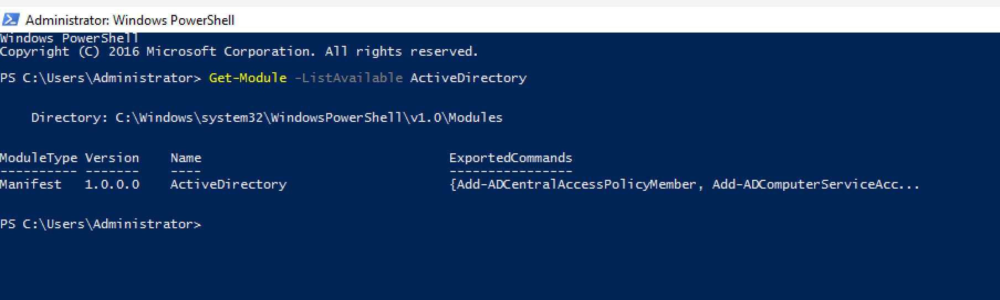

**Skills demonstrated:** PowerShell modules, Active Directory administration, environment validation

---

## 2. Active Directory User Query

Queried Active Directory to review usernames and enabled account status.

```powershell
Get-ADUser -Filter * |
Select-Object Name,SamAccountName,Enabled
```

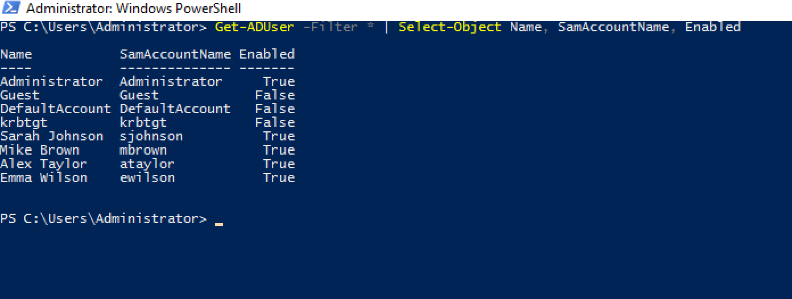

**Skills demonstrated:** `Get-ADUser`, account review, Help Desk investigation

---

## 3. New Employee Provisioning

Created a new employee account directly through PowerShell with:

- First and last name
- Username
- User Principal Name
- Employees OU placement
- Temporary password
- Enabled account
- Forced password change at next logon


The newly created user was also verified through Active Directory Users and Computers.

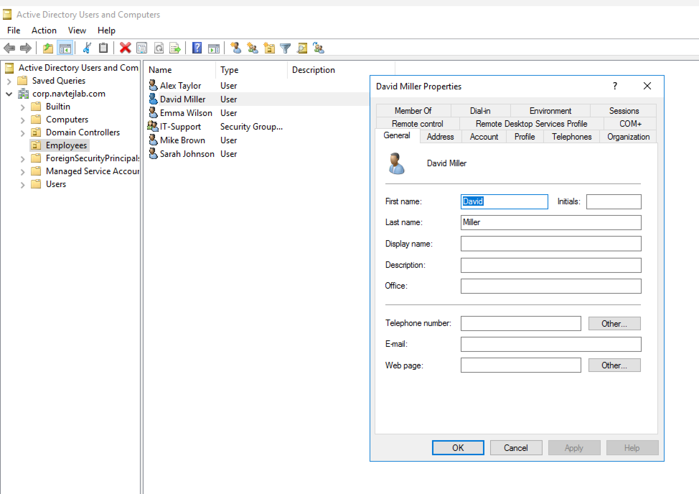

**Skills demonstrated:** `New-ADUser`, account provisioning, OU placement, Active Directory verification

---

## 4. Password Policy Troubleshooting

During account creation, Active Directory rejected a temporary password because it did not meet the configured domain password policy.

The error was reviewed, a stronger password was supplied, and account creation completed successfully.

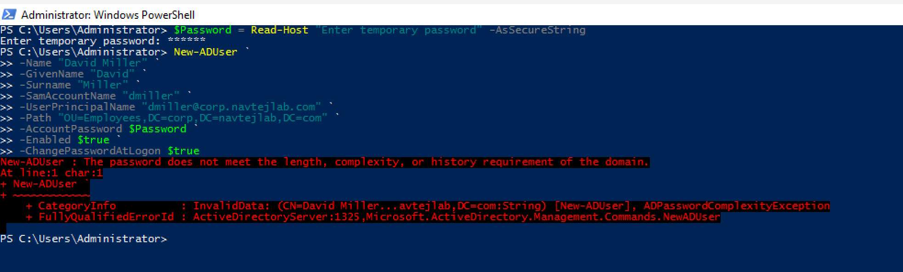

**Skills demonstrated:** troubleshooting, password policies, error interpretation, corrective action

---

## 5. Help Desk Password Reset

Reset a user's password through PowerShell and configured the account so the user must create a new password at the next sign-in.

```powershell
Set-ADAccountPassword -Identity dmiller -Reset -NewPassword $NewPassword

Set-ADUser -Identity dmiller -ChangePasswordAtLogon $true
```

Verification confirmed:

- Account enabled
- Password change required at next logon

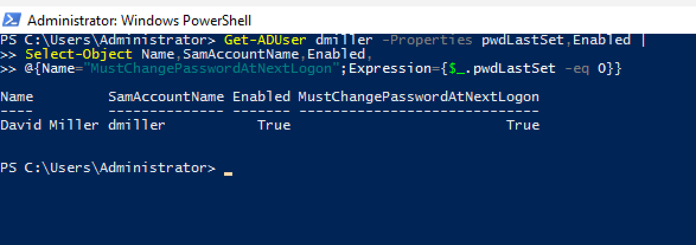

**Skills demonstrated:** password reset, account security, Active Directory support

---

## 6. Account Lockout Detection & Recovery

Simulated repeated failed sign-in attempts to trigger an Active Directory account lockout.

Detected the locked account with:

```powershell
Search-ADAccount -LockedOut
```

Then unlocked the account:

```powershell
Unlock-ADAccount -Identity dmiller
```

Verification confirmed:

```text
LockedOut: False
```


**Skills demonstrated:** account lockout troubleshooting, `Search-ADAccount`, `Unlock-ADAccount`, verification

---

## 7. Security Group Management

Added a user to the **IT-Support** security group:

```powershell
Add-ADGroupMember -Identity "IT-Support" -Members dmiller
```

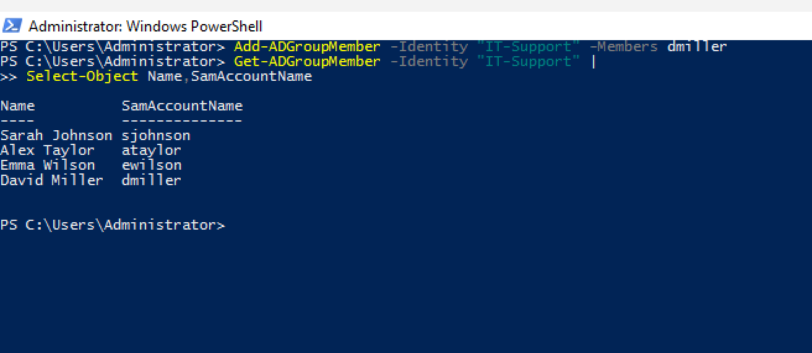

Then verified the user's group memberships:

```powershell
Get-ADPrincipalGroupMembership dmiller |
Select-Object Name,GroupScope,GroupCategory
```

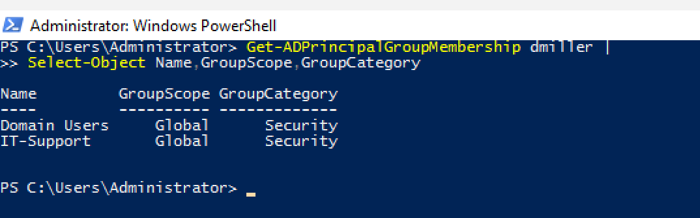

**Skills demonstrated:** security groups, access management, group membership verification

---

# Bulk User Provisioning

Instead of creating accounts individually, I created a CSV file containing multiple employees:

```csv
FirstName,LastName,Username
John,Smith,jsmith
Lisa,Patel,lpatel
Kevin,Lee,klee
```

PowerShell successfully imported the user list:

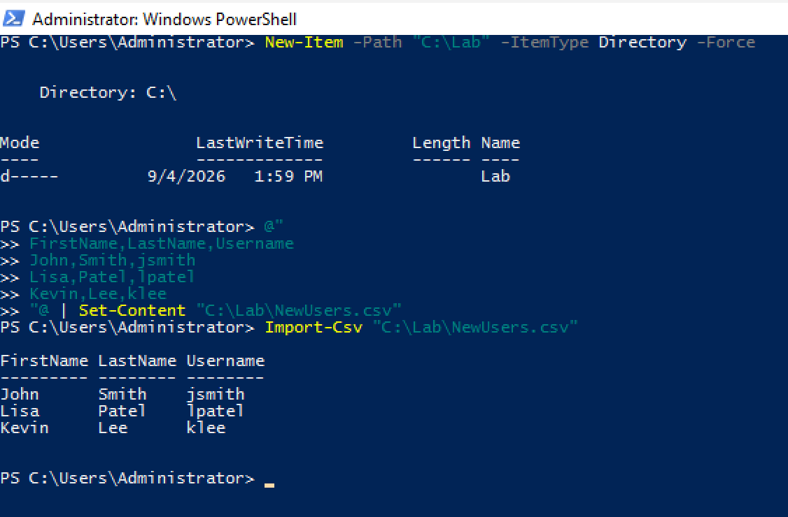

A `foreach` loop then created all three Active Directory accounts automatically.


The new accounts were verified afterward.

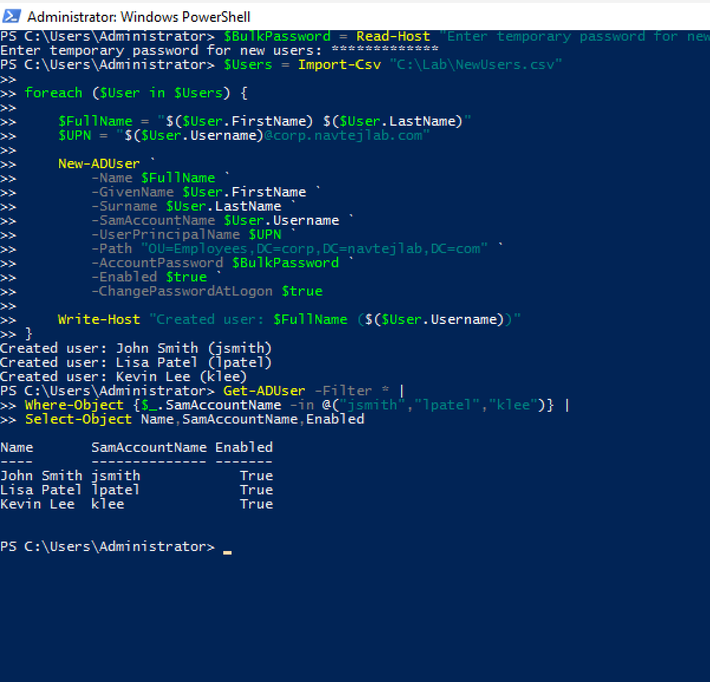

**Skills demonstrated:** `Import-Csv`, loops, bulk provisioning, Active Directory automation

---

# Reusable Employee Onboarding Script

I created a reusable PowerShell onboarding script:

[`New-HelpDeskUser.ps1`](./scripts/New-HelpDeskUser.ps1)

The script:

1. Imports the Active Directory module
2. Collects employee information
3. Creates the employee's full name and UPN
4. Checks whether the username already exists
5. Creates the Active Directory account
6. Enables the account
7. Requires a password change at next logon
8. Adds the employee to the IT-Support security group
9. Provides success or error output

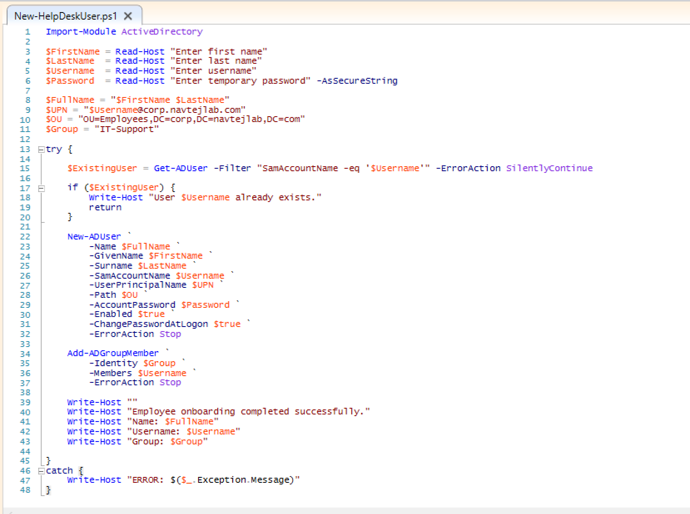

---

## Onboarding Script Execution

The script was tested with a new employee account.

The automation successfully created:

```text
Name: Peter Parker
Username: pparker
Group: IT-Support
```


The resulting Active Directory account and security-group membership were then verified.

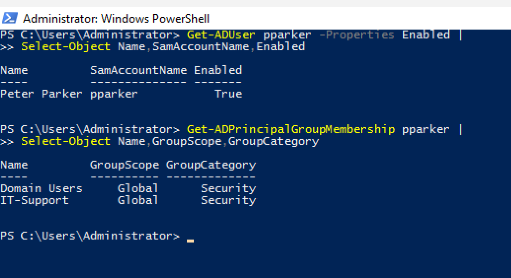

**Skills demonstrated:** reusable scripting, input handling, duplicate checks, error handling, account provisioning, group assignment

---

# Active Directory Reporting

Created a Help Desk-style Active Directory report containing:

- Name
- Username
- Enabled status
- Department
- Title

The report was displayed in PowerShell and exported to CSV.

```powershell
Get-ADUser -Filter * -Properties Department,Title,Enabled |
Where-Object {
    $_.SamAccountName -notin @(
        "Administrator",
        "Guest",
        "krbtgt",
        "DefaultAccount"
    )
} |
Select-Object Name,SamAccountName,Enabled,Department,Title |
Export-Csv "C:\Lab\AD-User-Report.csv" -NoTypeInformation
```


**Skills demonstrated:** Active Directory reporting, filtering, object selection, CSV export

---

# PowerShell Help Desk Automation Dashboard

The strongest part of this project was building a custom **Windows Forms Help Desk dashboard** using PowerShell.

The interface allows a technician to enter a username and perform common Active Directory support actions without manually entering PowerShell commands.


The dashboard script is available here:

[`HelpDesk-Automation-Dashboard.ps1`](./scripts/HelpDesk-Automation-Dashboard.ps1)

---

# Dashboard Features

The GUI provides the following Help Desk actions:

| Function | Purpose |
|---|---|
| Find User | Retrieve user name, username, enabled status, and lockout status |
| Unlock Account | Unlock a locked Active Directory account |
| Reset Password | Reset a password and require change at next logon |
| Enable Account | Enable a disabled Active Directory account |
| Disable Account | Disable an account with confirmation |
| Check Groups | Display the user's Active Directory group memberships |
| Add to IT-Support | Add a user to the IT-Support security group |
| Clear Output | Clear dashboard activity results |

The dashboard also includes a timestamped status/output area to provide feedback after each operation.

---

## Dashboard User Lookup

The **Find User** function successfully retrieved Peter Parker's Active Directory status.


The dashboard displayed:

```text
User found: Peter Parker
Username: pparker
Enabled: True
Locked Out: False
```

---

## Dashboard Group Membership Check

The **Check Groups** function retrieved the user's current Active Directory group memberships.

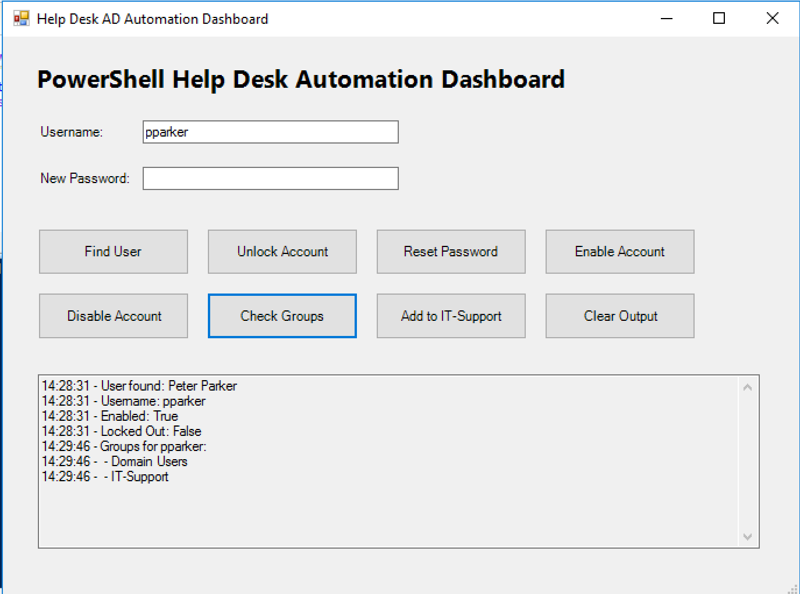

This confirmed membership in:

- Domain Users
- IT-Support

---

## Dashboard Password Reset

The dashboard successfully reset the user's password and required a password change at next logon.


Output confirmed:

```text
Password reset successfully.
User must change password at next logon.
```

---

## Dashboard Account Disable / Enable

The dashboard was used to disable the test account.

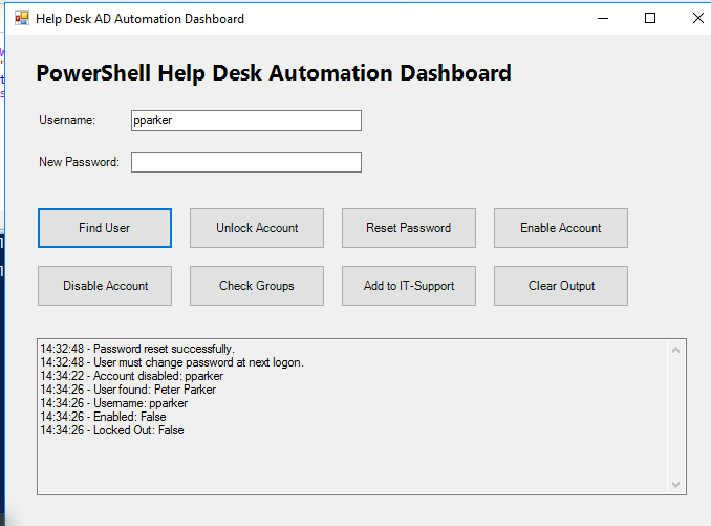

Verification confirmed:

```text
Enabled: False
```

The same account was then re-enabled.

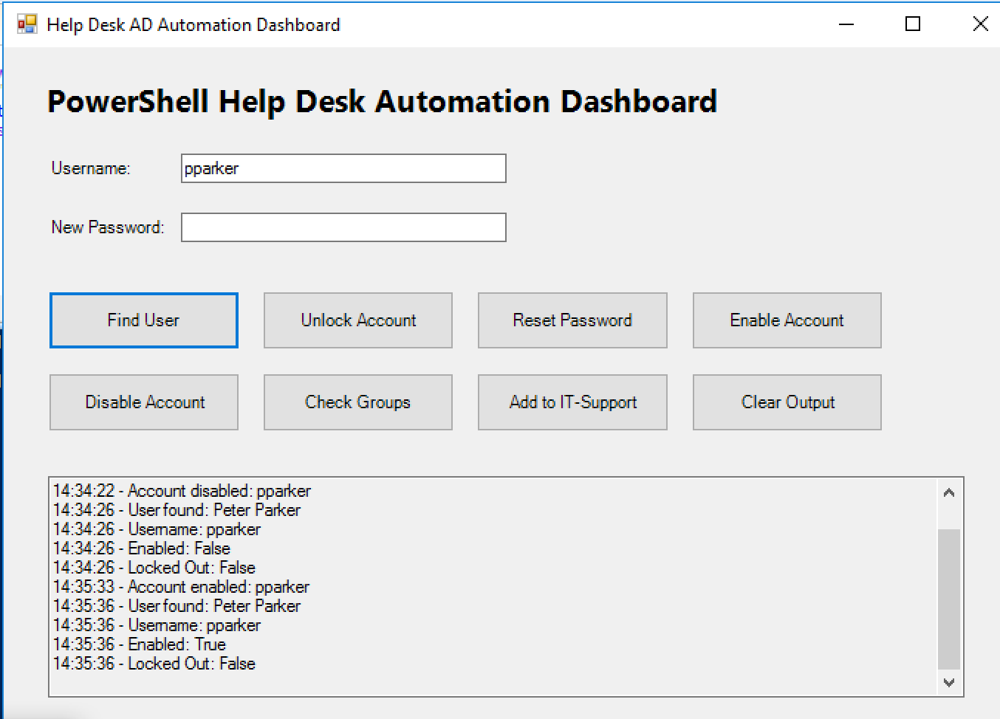

Verification confirmed:

```text
Enabled: True
```

---

## Dashboard Account Unlock

A real Active Directory lockout was generated through repeated failed login attempts.

The dashboard successfully detected:

```text
Locked Out: True
```

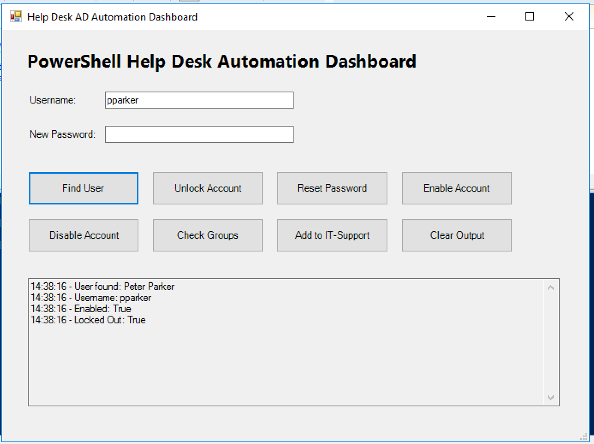

The account was then unlocked through the dashboard and rechecked.


Final verification confirmed:

```text
Locked Out: False
```

---

# Help Desk Automation Workflow

The project follows a structured support workflow:

**Identify → Query → Automate → Verify → Document**

### Identify

Understand the user's request or reported issue.

### Query

Retrieve the current Active Directory account state.

### Automate

Use PowerShell commands or the dashboard to perform the required administrative action.

### Verify

Confirm that the requested change was successfully applied.

### Document

Save output and technical evidence for troubleshooting and support documentation.

---

# PowerShell Commands Demonstrated

This project includes practical use of:

```powershell
Get-Module
Get-ADUser
New-ADUser
Set-ADAccountPassword
Set-ADUser
Search-ADAccount
Unlock-ADAccount
Enable-ADAccount
Disable-ADAccount
Add-ADGroupMember
Get-ADGroupMember
Get-ADPrincipalGroupMembership
Import-Csv
Export-Csv
Where-Object
Select-Object
ForEach
Read-Host
ConvertTo-SecureString
```

---

# Troubleshooting Scenarios

| Scenario | Troubleshooting / Automation | Result |
|---|---|---|
| AD module verification | Checked installed PowerShell modules | ActiveDirectory module confirmed |
| Password policy failure | Reviewed AD error and supplied compliant password | User creation succeeded |
| User account locked | Queried locked accounts and used `Unlock-ADAccount` | Account restored |
| Password reset request | Reset password and forced change at next logon | Password workflow completed |
| Group access request | Added user to IT-Support | Membership verified |
| Multiple employee accounts required | Imported CSV and automated account creation | Three users provisioned |
| Repetitive onboarding process | Built reusable provisioning script | User and group created automatically |
| User reporting required | Queried AD and exported data to CSV | Report generated |
| Routine Help Desk AD tasks | Built custom Windows Forms GUI | Tasks performed through dashboard |

---

# Error Handling

The reusable onboarding script includes:

- Duplicate username detection
- `try` / `catch` error handling
- `-ErrorAction Stop`
- Clear success output
- Clear error messages

Example:

```powershell
try {
    # Active Directory automation
}
catch {
    Write-Host "ERROR: $($_.Exception.Message)"
}
```

This helped make the script more reliable and easier to troubleshoot.

---

# Security Considerations

This project was created in a controlled home-lab environment using test accounts.

In a production environment, additional controls should be considered, including:

- Least-privilege administrative permissions
- Role-based access control
- Secure credential handling
- Password and secret management
- Administrative logging and auditing
- Input validation
- Change-management procedures
- Approval workflows for sensitive account changes

The dashboard is intended as a learning demonstration of PowerShell and Active Directory automation rather than a production-ready administrative application.

---

# Repository Structure

```text
PowerShell-Help-Desk-Automation-Lab/
│
├── README.md
│
├── scripts/
│   ├── New-HelpDeskUser.ps1
│   └── HelpDesk-Automation-Dashboard.ps1
│
├── sample-data/
│   └── NewUsers.csv
│
├── reports/
│   └── AD-User-Report.csv
│
└── screenshots/
    ├── 01-PowerShell-AD-Module-Verified.png
    ├── 02-PowerShell-AD-Users-Queried.png
    ├── 03A-PowerShell-Password-Policy-Error-Troubleshooting.png
    ├── 03-PowerShell-New-Employee-Created.png
    ├── 04-PowerShell-New-User-Verified-in-AD.png
    ├── 05-PowerShell-Password-Reset-and-Change-at-Logon.png
    ├── 06-PowerShell-Account-Lockout-Detected-and-Unlocked.png
    ├── 07-PowerShell-User-Added-to-IT-Support-Group.png
    ├── 08-PowerShell-Group-Membership-Verified.png
    ├── 09A-PowerShell-CSV-User-List-Verified.png
    ├── 09-PowerShell-Bulk-User-Creation.png
    ├── 10-PowerShell-Bulk-Users-Verified.png
    ├── 11-PowerShell-Employee-Onboarding-Script.png
    ├── 12-PowerShell-Onboarding-Script-Success.png
    ├── 13-PowerShell-Onboarding-User-and-Group-Verified.png
    ├── 14-PowerShell-AD-User-Report.png
    ├── 15-PowerShell-Help-Desk-Automation-Dashboard.png
    ├── 16-PowerShell-Dashboard-User-Lookup.png
    ├── 17-PowerShell-Dashboard-Group-Check.png
    ├── 18-PowerShell-Dashboard-Password-Reset.png
    ├── 19-PowerShell-Dashboard-Account-Disabled.png
    ├── 20-PowerShell-Dashboard-Account-Reenabled.png
    ├── 21A-PowerShell-Dashboard-Locked-Account-Detected.png
    └── 21-PowerShell-Dashboard-Account-Unlocked.png
```

---

# What I Learned

This project strengthened my understanding of how PowerShell can reduce repetitive Active Directory administration work in a Help Desk environment.

Instead of manually performing every task through Active Directory Users and Computers, I practised using PowerShell to query, create, update, unlock, enable, disable, and report on user accounts.

The CSV provisioning exercise demonstrated how a repetitive onboarding task can be converted into a scalable automation process.

Building the reusable onboarding script reinforced the importance of **input handling, duplicate checking, error handling, verification, and clear output**.

The GUI dashboard extended the project further by combining individual PowerShell commands into a technician-friendly interface for common support actions.

Most importantly, the lab reinforced that automation should not simply execute a command. A good support workflow should also **verify the result and clearly communicate whether the action succeeded or failed**.

---

# Skills Demonstrated

**PowerShell | Active Directory | Windows Server | Help Desk Automation | User Provisioning | Password Resets | Account Unlocks | Security Groups | Bulk User Creation | CSV Automation | Windows Forms | GUI Development | Active Directory Reporting | Error Handling | Troubleshooting | Technical Documentation**

---

# Career Relevance

The hands-on skills demonstrated in this project align with responsibilities commonly found in:

- Help Desk Technician
- IT Support Specialist
- Service Desk Analyst
- Desktop Support Technician
- Technical Support Specialist
- IT Support Analyst
- Junior Systems Administrator
- Active Directory Support
- Windows Support Technician

---

# Related Projects

## Active Directory Help Desk Lab

[View Active Directory Help Desk Lab](https://github.com/Navtej8000/Active-Directory-Help-Desk-Lab)

Hands-on Windows Server and Active Directory lab covering user and group administration, Group Policy, account lockout troubleshooting, file permissions, PowerShell onboarding, and domain support.

## DNS, DHCP & Network Troubleshooting Lab

[View DNS, DHCP & Network Troubleshooting Lab](https://github.com/Navtej8000/DNS-DHCP-Network-Troubleshooting-Lab)

Hands-on networking lab covering DNS, DHCP, IP addressing, APIPA recovery, RRAS/NAT, routing, subnetting, Windows Firewall troubleshooting, and structured network diagnostics.

## Microsoft 365, Intune & Entra ID Administration Lab

[View Microsoft 365, Intune & Entra ID Administration Lab](https://github.com/Navtej8000/Microsoft-365-Intune-Entra-ID-Lab)

Hands-on Microsoft cloud administration project covering Microsoft 365, Entra ID, Intune, MFA, SSPR, device compliance, application deployment, iOS management, and Conditional Access.

## Jira Service Management Help Desk Lab

[View Jira Service Management Help Desk Lab](https://github.com/Navtej8000/Jira-Service-Management-Help-Desk-Lab)

Hands-on ITSM project demonstrating ticket triage, troubleshooting, prioritization, escalation, internal documentation, and incident resolution.

---

# Author & Contact

**Navtej Singh**  
IT Support | Help Desk | PowerShell | Microsoft 365 | Intune | Entra ID | Active Directory | Networking  
Brampton, Ontario, Canada

[LinkedIn](https://www.linkedin.com/in/navtej-singh-4162351a5/) | [GitHub](https://github.com/Navtej8000)

---

**Portfolio Focus:** Hands-on Help Desk, PowerShell Automation, Active Directory, Microsoft 365, Endpoint Management, Networking, and IT Service Management projects.
