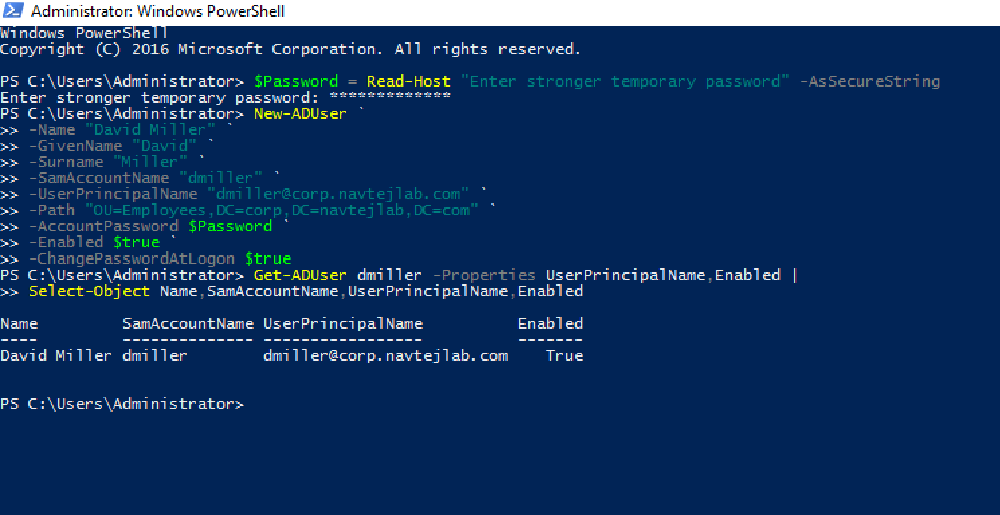
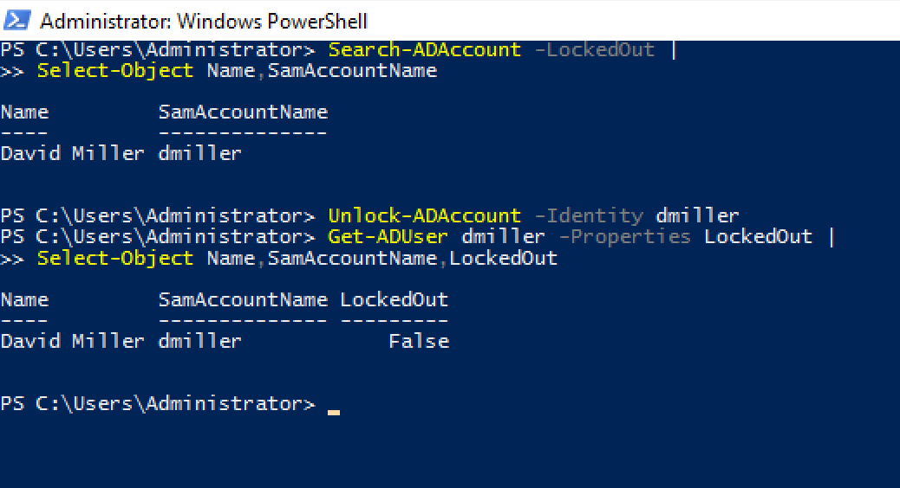
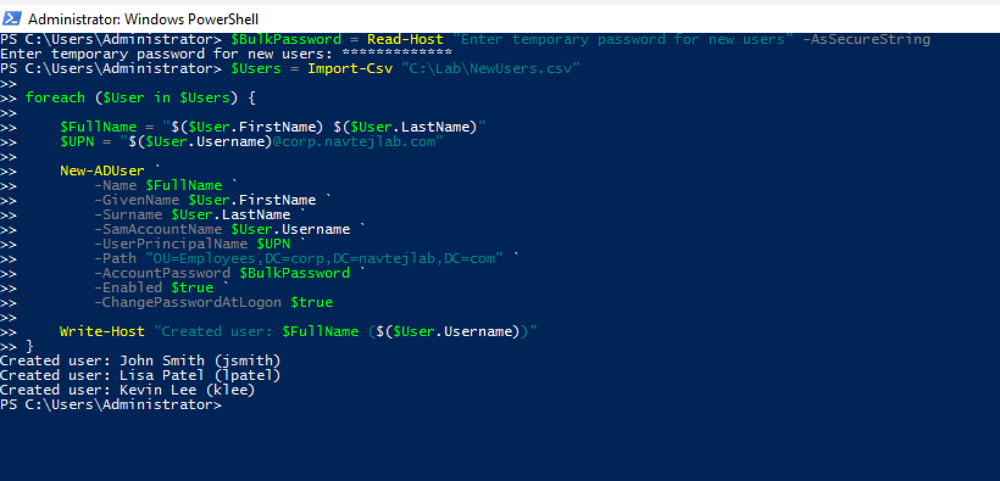
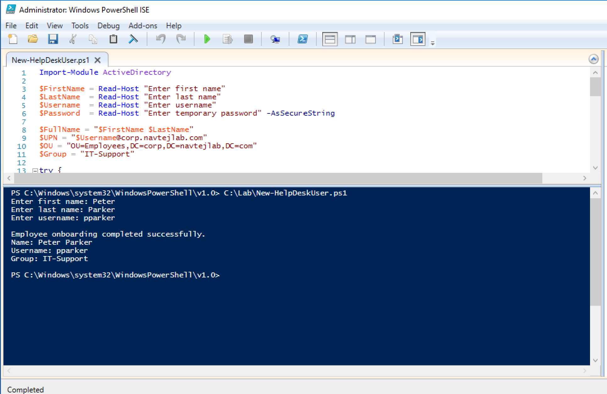
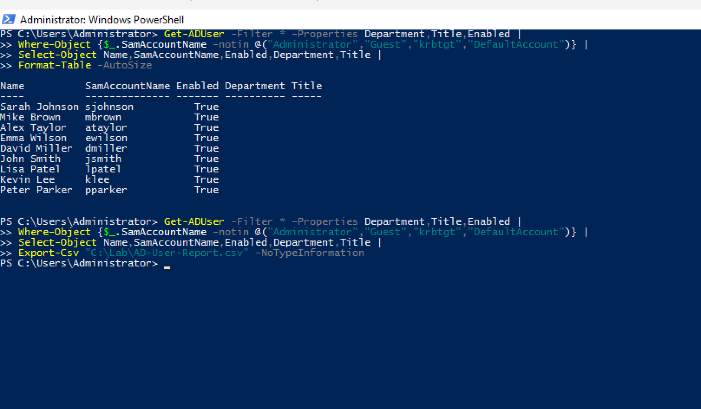
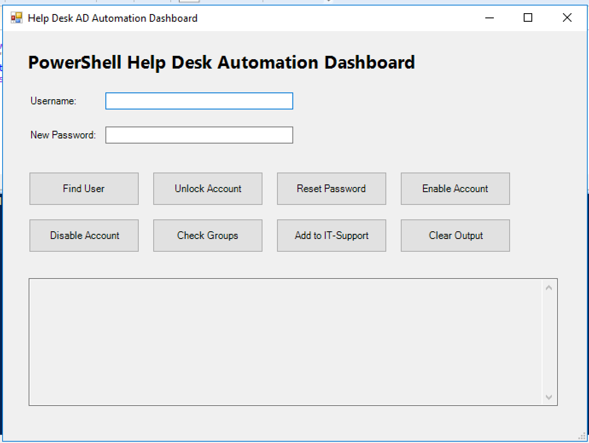
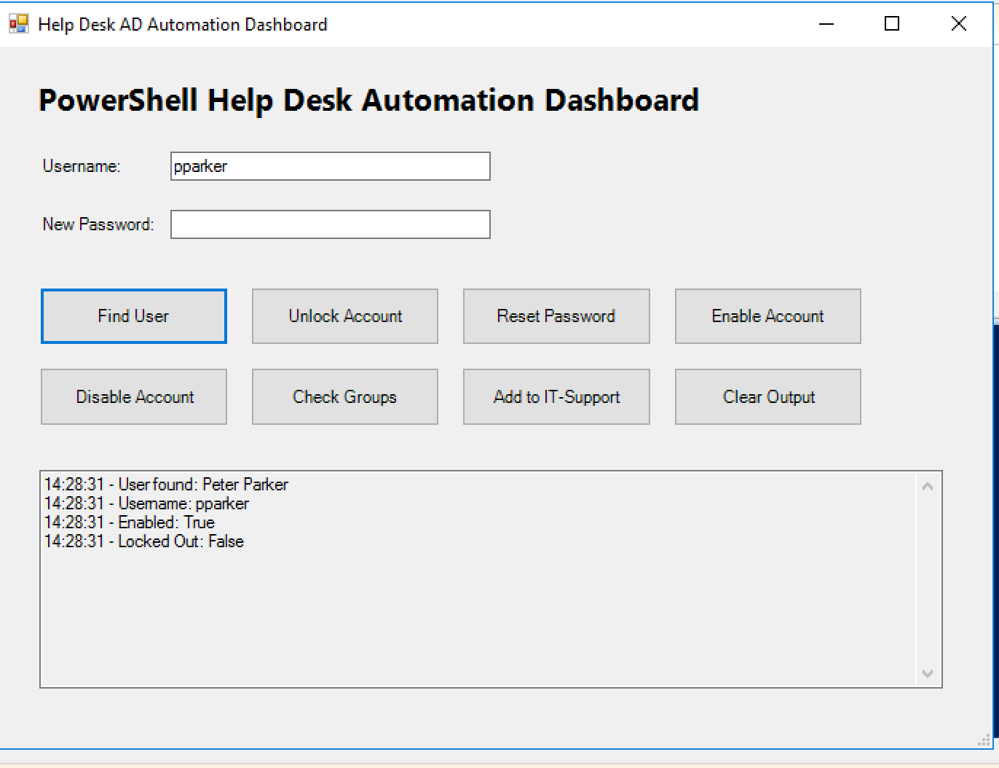
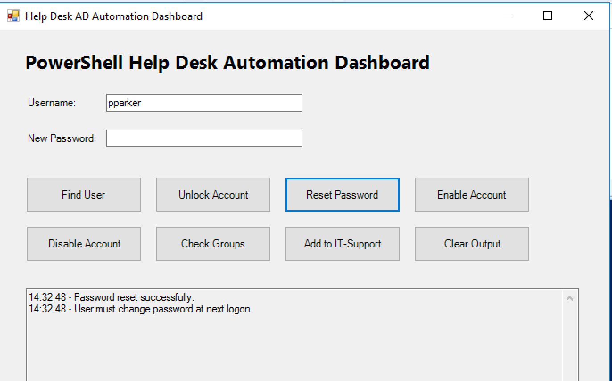
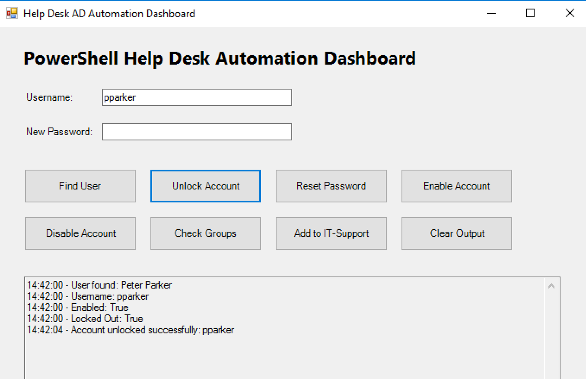

# PowerShell Help Desk Automation Lab

**PowerShell | Active Directory | Windows Server | Help Desk Automation | User Provisioning | Password Resets | Account Unlocks | CSV Automation | GUI Dashboard**

Hands-on PowerShell automation project demonstrating how common Active Directory Help Desk tasks can be automated, verified, and performed through a custom technician-friendly Windows GUI.

---

## Project Summary

I built this lab to practise **PowerShell automation for real-world Help Desk and IT Support tasks** in an Active Directory environment.

The project progressed from individual PowerShell commands to bulk automation, a reusable onboarding script, Active Directory reporting, and finally a custom **PowerShell Help Desk Automation Dashboard**.

### Tasks completed

- Queried Active Directory users and account status
- Created new employee accounts with PowerShell
- Troubleshot a domain password-policy failure
- Reset passwords and required password change at next logon
- Detected and unlocked locked accounts
- Managed Active Directory security-group membership
- Created multiple users from CSV data
- Built a reusable employee onboarding script
- Added duplicate-user checking and error handling
- Generated and exported an Active Directory user report
- Built a Windows Forms Help Desk dashboard
- Tested user lookup, password reset, account enable/disable, group checks, and account unlock from the GUI

---

## Lab Environment

| Component | Configuration |
|---|---|
| Domain Controller | DC01 |
| Domain | `corp.navtejlab.com` |
| Server | Windows Server |
| Directory Service | Active Directory Domain Services |
| Automation | Windows PowerShell |
| PowerShell Module | ActiveDirectory |
| Script Editor | PowerShell ISE |
| User OU | Employees |
| Security Group | IT-Support |
| Bulk Provisioning | CSV + PowerShell |
| GUI | PowerShell Windows Forms |
| Reporting | PowerShell + CSV |

---

# Selected Project Evidence

The screenshots below highlight the strongest technical outcomes from the project.

Complete evidence is available in the [`screenshots`](./screenshots/) directory.

---

## 1. New Employee Provisioning

Created a new Active Directory employee account using PowerShell with:

- First and last name
- Username
- User Principal Name
- Employees OU placement
- Temporary password
- Enabled account
- Password change required at next logon



**Skills demonstrated:** `New-ADUser`, Active Directory provisioning, OU management, account configuration

---

## 2. Account Lockout Detection & Recovery

Simulated failed login attempts to create a real Active Directory account lockout.

Detected the locked account using:

```powershell
Search-ADAccount -LockedOut
```

Then restored access using:

```powershell
Unlock-ADAccount -Identity dmiller
```



**Skills demonstrated:** account troubleshooting, lockout detection, account recovery, verification

---

## 3. Bulk User Provisioning

Created multiple Active Directory accounts automatically using a CSV file and PowerShell `foreach` loop.

Example CSV:

```csv
FirstName,LastName,Username
John,Smith,jsmith
Lisa,Patel,lpatel
Kevin,Lee,klee
```



**Skills demonstrated:** `Import-Csv`, loops, bulk provisioning, automation

---

## 4. Reusable Employee Onboarding Script

Built a reusable PowerShell script that:

1. Collects employee information
2. Checks whether the username already exists
3. Creates the Active Directory account
4. Enables the account
5. Requires password change at next logon
6. Adds the employee to `IT-Support`
7. Provides success or error output

Script:

[`New-HelpDeskUser.ps1`](./scripts/New-HelpDeskUser.ps1)

The script was successfully tested with a new employee.



**Skills demonstrated:** reusable automation, input handling, duplicate checking, error handling, provisioning

---

## 5. Active Directory User Reporting

Generated an Active Directory user report showing account information and exported the results to CSV.

```powershell
Get-ADUser -Filter * -Properties Department,Title,Enabled |
Where-Object {
    $_.SamAccountName -notin @(
        "Administrator",
        "Guest",
        "krbtgt",
        "DefaultAccount"
    )
} |
Select-Object Name,SamAccountName,Enabled,Department,Title |
Export-Csv "C:\Lab\AD-User-Report.csv" -NoTypeInformation
```



**Skills demonstrated:** reporting, filtering, `Select-Object`, `Export-Csv`, Active Directory administration

---

# PowerShell Help Desk Automation Dashboard

The strongest part of this project was creating a custom **Windows Forms Help Desk dashboard**.

The dashboard allows a technician to perform common Active Directory support tasks without manually entering individual PowerShell commands.



Dashboard script:

[`HelpDesk-Automation-Dashboard.ps1`](./scripts/HelpDesk-Automation-Dashboard.ps1)

---

## Dashboard Functions

| Function | Purpose |
|---|---|
| Find User | Retrieve user name and current account status |
| Unlock Account | Unlock a locked Active Directory account |
| Reset Password | Reset password and force change at next logon |
| Enable Account | Enable a disabled account |
| Disable Account | Disable an account with confirmation |
| Check Groups | Display the user's security-group memberships |
| Add to IT-Support | Add user to the IT-Support security group |
| Clear Output | Clear dashboard activity output |

The output area also displays timestamped results so the technician can immediately verify each action.

---

## Dashboard User Lookup

The dashboard successfully queried Peter Parker's account and displayed:

```text
User found: Peter Parker
Username: pparker
Enabled: True
Locked Out: False
```



**Skills demonstrated:** GUI automation, `Get-ADUser`, account-state verification

---

## Dashboard Password Reset

The dashboard successfully reset a user's password.

It also configured the account to require a new password at the next login.

```text
Password reset successfully.
User must change password at next logon.
```



**Skills demonstrated:** password administration, secure support workflow, GUI event handling

---

## Dashboard Account Unlock

A real account lockout was created through repeated failed login attempts.

The dashboard detected the locked account and was then used to restore access.

Final verification showed:

```text
Enabled: True
Locked Out: False
```



**Skills demonstrated:** account lockout troubleshooting, GUI automation, verification

---

# Additional Technical Evidence

<details>
<summary><strong>View additional lab screenshots</strong></summary>

### Active Directory Module & Queries

- [Active Directory PowerShell Module Verified](./screenshots/01-PowerShell-AD-Module-Verified.png)
- [Active Directory Users Queried](./screenshots/02-PowerShell-AD-Users-Queried.png)

### Password & User Administration

- [Password Policy Error Troubleshooting](./screenshots/03A-PowerShell-Password-Policy-Error-Troubleshooting.png)
- [New User Verified in Active Directory](./screenshots/04-PowerShell-New-User-Verified-in-AD.png)
- [Password Reset & Change at Logon](./screenshots/05-PowerShell-Password-Reset-and-Change-at-Logon.png)

### Security Groups

- [User Added to IT-Support](./screenshots/07-PowerShell-User-Added-to-IT-Support-Group.png)
- [Group Membership Verified](./screenshots/08-PowerShell-Group-Membership-Verified.png)

### Bulk Provisioning

- [CSV User List Verified](./screenshots/09A-PowerShell-CSV-User-List-Verified.png)
- [Bulk Users Verified](./screenshots/10-PowerShell-Bulk-Users-Verified.png)

### Automation Script

- [Employee Onboarding Script](./screenshots/11-PowerShell-Employee-Onboarding-Script.png)
- [Onboarding User & Group Verified](./screenshots/13-PowerShell-Onboarding-User-and-Group-Verified.png)

### Dashboard Testing

- [Dashboard Group Check](./screenshots/17-PowerShell-Dashboard-Group-Check.png)
- [Dashboard Account Disabled](./screenshots/19-PowerShell-Dashboard-Account-Disabled.png)
- [Dashboard Account Re-enabled](./screenshots/20-PowerShell-Dashboard-Account-Reenabled.png)
- [Dashboard Locked Account Detected](./screenshots/21A-PowerShell-Dashboard-Locked-Account-Detected.png)

</details>

---

# Help Desk Automation Workflow

Throughout the project I followed a structured workflow:

**Identify → Query → Automate → Verify → Document**

### Identify

Understand the user's request or reported issue.

### Query

Check the current Active Directory account state.

### Automate

Use PowerShell or the dashboard to perform the required administrative action.

### Verify

Confirm that the requested change was applied successfully.

### Document

Record the result and retain technical evidence.

---

# PowerShell Commands Demonstrated

```powershell
Get-Module
Get-ADUser
New-ADUser
Set-ADAccountPassword
Set-ADUser
Search-ADAccount
Unlock-ADAccount
Enable-ADAccount
Disable-ADAccount
Add-ADGroupMember
Get-ADGroupMember
Get-ADPrincipalGroupMembership
Import-Csv
Export-Csv
Where-Object
Select-Object
Read-Host
ConvertTo-SecureString
```

---

# Troubleshooting & Automation Scenarios

| Scenario | Action | Result |
|---|---|---|
| Password did not meet domain requirements | Reviewed AD error and supplied a compliant password | User creation succeeded |
| User account locked | Queried locked accounts and unlocked the account | Access restored |
| Password reset request | Reset password and forced change at next login | Password workflow completed |
| Security-group request | Added user to IT-Support | Membership verified |
| Multiple new employees | Imported CSV and automated provisioning | Multiple accounts created |
| Repetitive employee onboarding | Built reusable PowerShell script | Account and group assignment automated |
| User reporting request | Queried AD and exported results | CSV report generated |
| Routine Help Desk administration | Built custom Windows Forms dashboard | Common AD tasks performed through GUI |

---

# Error Handling

The onboarding script includes duplicate-account detection and structured error handling.

Example:

```powershell
try {
    # Active Directory automation
}
catch {
    Write-Host "ERROR: $($_.Exception.Message)"
}
```

The script also uses:

```powershell
-ErrorAction Stop
```

This makes failures easier to identify and troubleshoot.

---

# Security Considerations

This project was created in a controlled home-lab environment using test accounts.

In a production environment, additional controls would be required, including:

- Least-privilege administrative access
- Role-based permissions
- Secure credential management
- Input validation
- Administrative logging and auditing
- Change-management procedures
- Approval workflows for sensitive operations

The dashboard is a learning project demonstrating PowerShell and Active Directory automation rather than a production-ready administrative application.

---

# Repository Structure

```text
PowerShell-Help-Desk-Automation-Lab/
│
├── README.md
│
├── scripts/
│   ├── New-HelpDeskUser.ps1
│   └── HelpDesk-Automation-Dashboard.ps1
│
├── sample-data/
│   └── NewUsers.csv
│
├── reports/
│   └── AD-User-Report.csv
│
└── screenshots/
    ├── PowerShell lab evidence...
```

---

# What I Learned

This project strengthened my understanding of how PowerShell can reduce repetitive Active Directory administration work in a Help Desk environment.

Instead of performing every task manually through Active Directory Users and Computers, I used PowerShell to query, create, update, unlock, enable, disable, and report on user accounts.

Bulk CSV provisioning showed how repetitive onboarding can be converted into a scalable process.

Building the reusable onboarding script reinforced the importance of **input handling, duplicate checking, error handling, and verification**.

Creating the GUI dashboard showed how multiple PowerShell functions can be combined into a simpler technician-facing interface.

Most importantly, the lab reinforced that automation should not only execute a command — it should also **verify the result and clearly communicate whether the action succeeded or failed**.

---

# Skills Demonstrated

**PowerShell | Active Directory | Windows Server | Help Desk Automation | User Provisioning | Password Resets | Account Unlocks | Security Groups | CSV Automation | Bulk User Creation | Windows Forms | GUI Development | Active Directory Reporting | Error Handling | Troubleshooting | Technical Documentation**

---

# Career Relevance

This project demonstrates skills relevant to roles such as:

- Help Desk Technician
- IT Support Specialist
- Service Desk Analyst
- Desktop Support Technician
- Technical Support Specialist
- IT Support Analyst
- Windows Support Technician
- Junior Systems Administrator

---

# Related Projects

## Active Directory Help Desk Lab

[View Active Directory Help Desk Lab](https://github.com/Navtej8000/Active-Directory-Help-Desk-Lab)

Windows Server and Active Directory lab covering users, groups, Group Policy, account lockouts, file permissions, PowerShell, and domain support.

## DNS, DHCP & Network Troubleshooting Lab

[View DNS, DHCP & Network Troubleshooting Lab](https://github.com/Navtej8000/DNS-DHCP-Network-Troubleshooting-Lab)

Networking lab covering DNS, DHCP, IP addressing, APIPA, RRAS/NAT, routing, subnetting, and Windows Firewall troubleshooting.

## Microsoft 365, Intune & Entra ID Administration Lab

[View Microsoft 365, Intune & Entra ID Administration Lab](https://github.com/Navtej8000/Microsoft-365-Intune-Entra-ID-Lab)

Microsoft cloud administration project covering Microsoft 365, Entra ID, Intune, MFA, SSPR, endpoint management, compliance, and Conditional Access.

## Jira Service Management Help Desk Lab

[View Jira Service Management Help Desk Lab](https://github.com/Navtej8000/Jira-Service-Management-Help-Desk-Lab)

ITSM lab demonstrating ticket triage, troubleshooting, prioritization, escalation, documentation, and incident resolution.

---

# Author & Contact

**Navtej Singh**  
IT Support | Help Desk | Microsoft 365 | Intune | Entra ID | Active Directory | Networking  
Brampton, Ontario, Canada

[LinkedIn](https://www.linkedin.com/in/navtej-singh-4162351a5/) | [Email](mailto:singhnavtej824@gmail.com) | [GitHub](https://github.com/Navtej8000)


---

**Portfolio Focus:** Help Desk | PowerShell Automation | Active Directory | Microsoft 365 | Endpoint Management | Networking | IT Service Management
